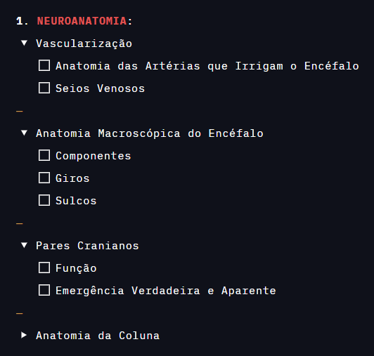

Uau, já faz muito tempo que escrevo para esse blog. Como dito no post de introdução, esse foi o meu primeiro semestre dentro da Faculdade de Medicina da Bahia da UFBA e muita coisa mudou na minha vida, não sobrando tempo para quase nada fora do curso (mais sobre isso a frente).

Sinto-me triste ao pensar que não pude escrever durante todo esse tempo. Entretanto, não desisti do blog nem por um segundo, apenas esperei o momento certo para melhorar minha estratégia de escrita para que caiba no meu [cronograma universitário](https://drive.google.com/file/d/1ET5O_RQmoq6CjCgdq6wvJ34GZ12Hzzko/view?usp=sharing), e estou tendo progresso em relação a isso.

Decidi diminuir a quantidade de quadros no site e focalizar em assuntos mais esporádicos que venham a mente, apenas tendo como constante o relatos de livros lidos no mês, filmes, séries, animes, etc.

O primeiro semestre já se foi depois de muita luta. O objetivo desse post é planejar objetivos e refletir como melhorar o próximo ano, tendo em mente o que eu passei durante os últimos dois semestres, entendendo passo a passo do que deu errado e do que deu certo.

Esse blog, como já pode ser observado, é longo. Entretanto, o que será dito nele aparecerá diversas vezes nos posts que virão durante o ano de 2023, principalmente o primeiro semestre.

### Liga Acadêmica de Neurocirurgia 🧠

Meus primeiros contatos com as matérias médicas desse semestre apenas ardeu ainda mais a chama amorosa que eu tenho pela neurociência, algo que foi amplificado com a [Liga Acadêmica de Neurocirurgia da Bahia](https://www.instagram.com/lanc_ba/), mais conhecida como a maravilhosa **LANC**.

Na primeira semana de aula, não tivemos aula, o que foi uma coisa boa, porque eu estava exausto do ELV-SUS. Porém, durante os cinco primeiros dias, passamos por diversas palestras, visitas e gincanas realizadas pela própria faculdade; experiências extremamente agradáveis que tornaram meu semestre leve desde o começo. Um desses dias era dedicado aos _stands_ do [Carcará](https://www.instagram.com/medufba.carcara/) (atlética da FMB) e, principalmente, das Ligas Acadêmicas. 

No Brasil, as Ligas Acadêmicas são associações de estudantes de diferentes anos da **graduação médica** que buscam aprofundar seus conhecimentos, orientando-se segundo os princípios do **“tripé universitário”**: ensino, pesquisa e extensão. Dentre os *stands* ali presente, o que mais me chamou atenção foi a LANC.

Eles não tinham o *stand* mais elaborado do mundo, apenas um computador e dois apresentadores extremamente apaixonados pela área, e isso foi o suficiente para mim. Estar ali me deu confiança de que eu podia um dia ser membro e fazer parte daquela família, conversando e estudando sobre essa área que tanto gosto. 

Depois de bater um papo com os membros, eles me convidaram para ver a sessão aberta que aconteceria a noite naquele dia; eu, obviamente, aceitei essa proposta, mesmo sabendo que eu moro do outro lado da cidade, e não me arrependo dessa decisão nem por um segundo. 

O tema daquele dia não sai da minha cabeça: **Rebaixamento do Nível de Consciência**. Lembro-me de não entender quase nada, apenas estar fascinado com todo aquele ambiente e com, pela primeira vez, a observação de um caso clínico. Saí de lá mais decidido do que antes, “**eu vou entrar nessa liga**”.

Depois disso, comecei a ir para praticamente todas as sessões abertas que eu podia, mesmo tendo uma grade horrível. Comprei um livro chamado “[50 Casos Clínicos em Neurocirurgia e Neurociência](https://www.sanarsaude.com/livro/50-casos-clinicos-em-neurocirurgia-e-neurociencia)” da Sanar Medicina justamente para realizar uma imersão na área e entender mais as aulas. Sendo assim, torna-se óbvio um dos meus objetivos para o primeiro semestre do ano que vem.

💎 **Tornar-se Membro da Liga Acadêmica de Neurocirurgia da Bahia**

Para isso, tinha pedido dicas para um colega do ELV-SUS, Gabriel, que é membro da liga (amém!) e ele me contou como é de maior importância eu ir bem na entrevista e frequentar as sessões abertas, algo que eu fiz.

A seleção da LANC é feita em três etapas: prova teória, currículo e entrevista.

Ítalo, membro veterano da LANC, e que trabalha para o [Sétimo Ano](https://www.instagram.com/setimo.ano), me revelou que eu deveria focar na entrevista também, o currículo é relevado para calouros, e a prova teória é só para saber o básico e olhar os vídeos no YouTube recomendados.

Estando agora de férias, não posso fazer muito em relação às sessões abertas e criar laços, já fiz satisfatoriamente bem isso durante o semestre. Currículo não preciso me preocupar muito, mas também já criei o Lattes necessário com tudo que fiz como acadêmico até agora.

Por fim, só falta a prova teórica. Peguei o edital do semestre anterior (recomendação de Gabriel) e fiz uma página no Notion dedicada a rastrear os assuntos que eu já estudei e os que faltam estudar:

Sendo assim, oro para que tudo dê certo, e que isso seja apenas um passo nessa grande jornada.

### Igreja Presbiteriana do Brasil ⛪

Uma das coisas que eu me arrependo amargamente é minha baixa presença eclesiástica. Junto a isso, minhas leituras bíblicas e orações diminuiram drásticamente; é legal dizer ser cristão, difícil é ser um.

Sofri vários avisos do pastor sobre a minha ausência, criei várias boas amizades dentro da FMB, tenho outras ainda do IFBA, entretanto preciso de amigos da igreja também, pessoas com fé em Cristo que eu possa confiar e escapar um pouco desse mundo acadêmico.

Portanto, uma das minhas metas é:

💎 **Tornar-me Mais Presente na Igreja**

Além disso, voltarei a ter o hábito de ler a Bíblia com um cronograma e orar duas vezes por dia.

💎 **Criar o Hábito de** (1) **Ler a Bíblia** (2) **Orar Diariamente**

Também irei voltar a ler mais livros cristãos, fiquei muito focado em outros gêneros e abandonei aqueles que tratam do que é mais importante na vida, Jesus.

### PC Master Race 😍

Finalmente estou recebendo uma bolsa de assistência da faculdade que dá um valor razoável mensalmente, principalmente para alguém (como eu) que não pode trabalhar e estudar ao mesmo tempo.

Estou pensando em investir naquilo que mais me ajudou na minha aprovação: meu computador.

Atualmente, minhas configurações são razoáveis, porém dá para melhorar muito:

**CPU** | Ryzen 5 1400 @ 3.2 GHz  
**MEMORY** | Juhor 16GB (2x8) DDR4 @ 3200 MHz CL16  
**GPU** | COLORFUL GeForce GTX 1060 3GB iCafe  
**MOTHERBOARD** | MSI B450M PRO-M2 MAX  
**STORAGE** | Netac NVMe 256GB + Seagate HDD 320GB  
**POWER SUPPLY** | Gigabyte P650B  
**CASE** | PCYes Nova  
**MONITOR** | AOC 18,5" 9P1E  
**HEADPHONE** | Bluedio H2  
**KEYBOARD** | Multilaser TC234  
**OS** | Windows 10  

Desejo mudar o processador, estou entre o [_**Ryzen 5 5600**_](https://youtu.be/GT-pHiLQOKg) (R$ 620) e o [_**Ryzen 5 5500**_](https://youtu.be/-BMiks9PhW8) (R$ 470). A minha 1400 é bem fraquinha, em jogos de mundo aberto é onde ela sofre mais, pois o gargalo é gritante. Devido a isso, talvez esse seja o primeiro upgrade que eu faça, pois comprar uma nova placa de vídeo sem um processador bom apenas vai repetir o problema que estou tendo agora.

Ainda estou em dúvida sobre qual dos dois pegar. Contextualizando, o [5500 é basicamente um 3600/5600G](https://youtu.be/4JebBhH-B88), e o 5600 é um monstro que vai durar muitos anos. Dependendo do desconto, não vou resistir não pegar o 5600, porém tudo pode acontecer até 22 de janeiro, que é a data do Ano Novo Chinês, [uma das melhores épocas de promoção do Aliexpress](https://youtu.be/8DQqtptYcrE?t=107).

Sobre placas de vídeo, estou pensando em pegar a [_**ASUS GeForce RTX 2060 6GB**_](https://youtu.be/iF9eNdoYr10) (R$ 1050). Essa GPU é um sonho pra mim, ela já passou de ser 1900 no Ali para 1500 e agora 1050, podendo ser bem menor na promoção de Ano Novo. Estou muito tentado em pegá-la primeiro que o processador, mas ainda tenho que ver como tudo vai proceder na época da promo, ainda mais pensando em quanto vou ter reservado até lá, talvez o dinheiro todo necessário para comprar os dois, talvez só um.

Outro upgrade que eu realmente necessito seria um HD. Como pôde ser observado nas minhas configurações, atualmente eu só tenho um total de 576GB, sendo que a maior parte atualmente já está sendo ocupada, me obrigando a ficar desistalando jogos e deletando arquivos. Estou em mente o [_**Western Digital Blue 2TB**_](https://youtu.be/x6gTvM1GIig) (R$ 320), dois terabytes é excelente para não precisar me preocupar muito com armazenamento por um bom tempo. Pensei em pegar um [_**SSD Netac de 1TB**_](https://www.aliexpress.com/item/1005003116455437.html?spm=a2g0o.cart.0.0.1f8638da5anfqe&mp=1) (R$ 290), pois os preços são semelhantes, entretanto, mesmo sendo mais lento, um HD de 2TB vai proporcionar o que eu mais anseio agora, armazenamento bruto.

Por último, preciso de um novo mouse. Não quero gastar muito, portanto decidi ir no melhor custo benefício que encontrei nos últimos tempos, [_**Razer Viper Mini**_](https://youtu.be/EX5-dI6ylEg) (R$ 140), provavelmente o comprarei em janeiro também.

### Listinha 2023 🤠

Um dos meus maiores erros esse ano foi colocar uma meta de livros/filmes, mas não ter a mínima ideia de quais consumir ou por onde começar. Aprendi com a experiência que toda meta fica mais fácil quando já existe o primeiro passo.

Por isso, a seguir, iremos viajar um pouco nos (1) jogos, (2) livros e (3) animes que quero consumir nesse ano de 2023.

Uma das coisas mais importantes para mim é me manter em contato com diversas formas de arte e cultura, colocar uma meta acerca disso é fundamental para minha estabilidade mental, além de ser muito legal.

##### 1. Games (ed. 2023):

**STAR WARS Jedi: Fallen Order™** | O único _souls-like_ que eu já joguei foi o primeiro **Dark Souls**, e gostei do gênero. Mesmo não sendo o maior, ainda sou um fã de Star Wars. Assim, nada melhor do que misturar essas duas coisas em uma só. Estou bastante ansioso por esse desde que o vi pela primeira vez há anos, espero que seja uma boa experiência, pois só estou esperando o ano virar para poder jogá-lo.

**God of War** | O novo game do **Bom da Guerra** foi um dos primeiros que eu joguei quando montei o meu computador atual. Na época, mesmo gostando muito do jogo, eu tinha outros planejamentos e o deixei de lado. Agora pretendo voltar a jogá-lo, principalmente por causa da sequência que foi lançada recentemente, **God of War: Ragnarok**.

**The Last of Us™ Part I** | É um pecado esse jogo ter demorado tanto para sair no PC. Porém, finalmente, FINALMENTE, no dia 03 de março, apenas 3 dias antes do meu semestre começar, os jogadores de computador poderão apreciar as aventuras de Joel e Ellie. Espero que a versão da Steam Verde saia rápido, mesmo sendo pesada, pois estou sonhando com esse jogo há muito, MUITO tempo; tanto que estou pensando seriamente em pegá-lo na Steam Azul, mesmo sendo 167 reais!

**The Witcher 2: Assassins of Kings** | A saga The Witcher é uma das mais consagradas não só nos videogames, mas também na literatura (como poderá ser observado mais a frente). Portanto, decidi finalmente me aventurar na jornada de Geralt of Rivia, começando pelo segundo jogo da trilogia (em preparação para o terceiro), pois o primeiro é simplesmente injogável para mim.

**FINAL FANTASY X/X-2 HD Remaster** | O meu jogo favorito de toda vida é o sétimo da franquia Final Fantasy; os personagens, a história, a trilha sonora, a jogabilidade, o ambiente, tudo me faz querer ficar naquele mundo mais e mais. Sendo assim, aqui estou eu mais uma vez para me apaixonar novamente, agora com um considerado o melhor da franquia (X). Além do VII, o último que eu joguei foi o meu tão amado XV, que, mesmo não sendo o melhor que já joguei (e a crítica concorda), ainda é um ótimo jogo com uma história, infelizmente, muito runshada.

##### 2. Livros (ed. 2023):

**O Festim dos Corvos** + **A Dança dos Dragões** | A saga das Crônicas de Gelo e Fogo está se tornando a minha favorita, sendo o melhor dos três que eu li até agora A Tormenta de Espadas (10/10). Portanto, agora irei finalizar essa obra linda e incompleta, adentrando ainda mais no mundo de Westeros.

**A Saga “The Wither”** | Em preparação para os jogos, irei ler os livros que os inspiraram. Já ouvi várias recomendações dessa série, algo que me surpreendeu bastante, pois só conhecia o jogo até então. Baixei no Kindle os três primeiros e veremos se vale a pena continuar.

**We Were Liars** | Já estava reservando esse há muito tempo. Mistério envolvendo adolescentes, tem como dar errado? ... _13 Reasons Why left the room_. Sou fã de um bom mistério, e esse foi bastante recomendado a mim durante muito tempo, hora de dar uma chance esse ano.

**Sobre Meninos e Lobos** | Outro livro de mistério, mas agora um mais consagrado. Mystic River, nome original, é um filme muito conhecido baseado no livro, escrito pelo mesmo autor de “**A Ilha do Medo**”, adaptado em filme pelo Martin Scorscese (ótimo filme, btw). Com esse currículo, decidi dar uma chance a esse também.

**The Children of Men** | A fonte original do filme de mesmo nome do Alfonso Cuarón.. precisa de mais?

**The Lord of the Flies** | Um clássico que eu nunca li. Consumi bastante literatura clássica esse ano (A Metamorfose, A Morte de Ivan Ilitch, O Alienista, Na Colônia Penal, O Sonho de Um Homem Ridículo), e quero aumentar meu acervo em 2023.

**Contra a Perfeição** | A engenharia genética em humanos é um assunto problemático. Para ser sincero, o único argumento que eu conheço contra tal tecnologia é a eugenia, por isso estou bastante curioso para ler esse livro e me aprofundar mais ainda nesse assunto que é tão importante para a minha futura área de atuação, a Medicina.

**Atomic Habits** | Um das minhas metas esse ano é ser mais organizado, e isso resume bem o que vou precisar para melhorar meu físico, hábitos de leitura, oração e, claro, estudos. Atomic Habits é basicamente uma das bíblias da produtividade, comecei a ler um pouco e estou ansioso para poder aplicar os seus ensinamentos em tudo na minha vida; espero que seja de grande utilidade.

**The Motivation Myth** | Mais uma das leituras essenciais de qualquer canal de produtividade. Motivação é um mito, já apliquei muito isso na minha vida, porém nunca vi base científica para tal uso, por isso essa será uma leitura fundamental para esse ano de 2023.
	
**Deep Work** | Uma recomendação do [James Scholz](https://youtu.be/kICh_d6tHQk). Eu gostei do livro “**How to Win at College**” do mesmo escritor, Cal Newport, e apliquei muito que ele ensinou ali (e muitas outras eu queria ter seguido melhor). Deep Work irá me ajudar a entender a importância de me manter focado em um mundo cheio de distrações em que vivo e poder ser mais produtivo ao eliminá-las.

**The Defining Decade: Why Your Twenties Matter** | Fevereiro é o mês do meu aniversário, logo no início de 2023, 20 anos. Como o título do livro diz, "A Dêcada que Define", quero tirar o melhor da minha juventude para ter um futuro grande pela frente para mim e para minha atual e futura família. Quero que meus filhos cresçam com oportunidade e tenham mais escolhas, coisas que eu não tive. Para isso, tenho que aprender como aproveitar o máximo desse período, e espero que esse livro me ajude com isso.

**Every Patient Tells a Story** + **Do No Harm** | Mais dois livros de Medicina para 2023. Esse ano eu só li um, “**The Laws of Medicine**”, e quero aumentar meu acervo, principalmente sobre neurocirurgia, já que uma das minhas metas esse ano é entrar na LANC. Aliás, “**Do No Harm**” foi uma recomendação do neurocirurgião Danilo Quadros em uma sessão aberta da LANC.
	
**Seeking Allah, Finding Jesus** | Mais um livro para 2023 com a função de aumentar meu acervo apologético. É uma infelicidade lembrar que Nabeel Qureshi não está mais entre nós, já repeti várias vezes [vídeos](https://youtu.be/I46JquDHdCQ) de apologética dele no YouTube, além de ter bastante confiança na recomendação do [David Wood](https://youtu.be/Qx1IkH5pNH0).

**Five Proofs of the Exitence of God** | Depois de “**Aquinas - A Beginner's Guide**”, estou muito animado para aprender mais sobre a Teologia Natural mais focada agora nos argumentos para a existência de Deus.

**Libido Dominandi** | Pornografia é uma doença, e o vício nela é perigoso. Não queria ler um livro mais ou menos sobre o assunto, ou um que queira me vender curso, pois a comunidade _NoFap_ virou um monstro incontrolável nos últimos tempos. Esse volume já está (adivinhe) guardado nas minhas listas apenas esperando o momento certo; espero que esse ano finalmente eu possa o tirar dessas listas.

**A Personal Odyssey** + **Intellectuals and Race** | Gosto muito dos conteúdos do Thomas Sowell, ele é um homem negro, inteligente, que veio de periferia. Quero começar a entender os pensamentos dele através de uma biografia, creio que seja ainda motivador para mim, que tem uma vida parecida com esses autores negros, além de já começar a entender a temática negra em uma perspectiva conservadora; espero extrair muitos ensinamentos desse.

**The Evolution of Desire** | Psicologia Evolutiva é um tema extremamente interessante, esse livro foi um dos que eu mais vi recomendados acerca do assunto, escrito por um autor bastante conhecido por temas nesse estilo, além de participar de várias pesquisas famosas, como “**Why Humans Have Sex**”, onde temos cerca de 250 razões do porquê seres humanos tem relações sexuais, uma descoberta extremamente interessante.

**What He Must Be To Marry My Daughter** | Um livro sobre masculinidade cristã. O último que eu li foi “**Thoughts for Young Men**”, que foi uma boa experiência. Entretanto, estou precisando voltar as raízes e ver mais argumentos acerca do assunto, já que viver em uma universidade liberal cria diversos conflitos de gênero na minha cabeça; gosto do escritor pelo que vi dele no YouTube, e o livro é bem recomendado.

##### 3. Animes (ed. 2023):

**Re:Zero − Starting Life in Another World** | Pensei muito em, ao invés de assistir, ler as _light novels_, porém minha lista de leitura está muito grande, então o anime vai servir. Provavelmente eu estou muito atrasado na vibe do Re:Zero, mas eu gostei muito do primeiro volume que eu li, e espero que as duas temporadas valham a pena.

**Attack on Titan, SEASON 3/4** | Não aguento mais ficar por fora do que diabos está acontecendo em SNK!

**Demon Slayer** | Um dos animes mais vendidos de todos os tempos, e eu não tive tempo ainda de assistir; hora de ver o que isso realmente é.

**Vinland Saga** | Outro exemplo que eu queria ler para depois assistir.

**Jujutsu Kaisen** | Mais um anime muito famoso que eu perdi a época. Recebi muitas recomendações para assistir esse, portanto quero logo saber do que se trata.

### Conclusão

Espero que esse próximo ano seja excelente para todos nós. Espero que minhas metas sejam batidas, que eu consiga ser uma pessoa melhor e tenha disciplina. 

Agradeço a Deus por tudo que aconteceu esse ano comigo: passei em Medicina, entrei em uma igreja, viajei para Vitória da Conquista em um estágio, fiz muitas amizades, montei meu primeiro computador gamer, me divertir muito, socializei como nunca antes na minha vida, e isso é só uma parte.

Que todos tenham um bom Ano Novo e até ano que vem!

--

**OBS**: Para compensar os meses sem post, fiquem com essa playlist maior que o normal e das boas, de nada.

[Typa Girl](https://youtu.be/UhxW9Njqqu0) | BLACKPINK

[걱정말아요 그대](https://youtu.be/RTur8Up2f2I) | Jun In Kwon

[Dreamers](https://youtu.be/gfZChizkEuI) | Jung Kook (BTS)

[ICON](https://youtu.be/wfXETdOzYos) | TWICE

[F.I.L.A](https://youtu.be/I4xliZW07tk) | TWICE

[CRUEL](https://youtu.be/HQXBAGVSOyY) | TWICE

[Esú](https://youtu.be/opgimBI2Rqk) | Baco Exu do Blues

[Kanye West da Bahia](https://youtu.be/7wwEB2VTFZ4) | Baco Exu do Blues

[Abre Caminho](https://youtu.be/cuXZ-hKzpqg) | Baco Exu do Blues

[That’s What I Like](https://youtu.be/PMivT7MJ41M) | Bruno Mars

[24K Magic](https://youtu.be/UqyT8IEBkvY) | Bruno Mars

[Show Me](https://youtu.be/RIpzCc7PAlA) | Bruno Mars

[Corda Bamba](https://youtu.be/pBRJSNxaVEc) | Delacruz & Lourena

[She Loves Control](https://youtu.be/nKcKreZJYfI) | Camila Cabello

[Variations on a Rococo Theme, Op. 33](https://youtu.be/u5M1n5A0t10) | Pyotr Ilyich Tchaikovsky

[Safezone](https://youtu.be/VEGQcRxM9Us) | Yung Buda

[Stranger's Sweater](https://youtu.be/HOnAwcwOMeI) | Emi Choi

[On Your Mind](https://youtu.be/u4rAbt5xuOo) | Emi Choi

[Melancholy Mood](https://youtu.be/sOvI903rSPw) | Emi Choi

[Blinding Lights](https://youtu.be/fHI8X4OXluQ) | The Weeknd